# 01_SERVERLESS_ARCHITECTURE

Number One. How to deploy platform architecture consisting of multiple serverless functions.

I hope this one will be nice and straightforward, or at least in relation to many problems experienced and solved by Platform Engineers.

## Aims
- Deploy simple, serverless functions to a cloud provider, passing messages between them. 
- A personal-first outing on a platform that isn't Azure.

## Scenario
Spike the setup and execution of basic serverless architecture containing two functions. A sender and receiver. The contents of the sender's payloads is not important, but must be understood and processed by the receiver.

Assess multiple cloud providers' relative ease of deployment and functionality.

## Serverless Architecture

Now is a good opportunity to briefly explain what Serverless Architecture is - for my own benefit... When I first heard of the term, I assumed some cloud wizardry was at play, which removed the need for code to be deployed on a server, at all. In reality, it isn't as mysterious.

Serverless Computing relies solely on the chosen cloud provider to execute application code in response to well-defined events, such as HTTP requests or timers. The cloud provider will automatically assign the required compute resources to the application, and scale this to meet demand. 

This type of architecture is useful for cost saving, and makes for a great first venture into Platform Engineering. When not in use, the cloud provider scales down the resources completely, removing or reducing running costs. As long as a platform has a well-adjusted scaling plan, this can save effort and outgoing costs to a cloud provider.

The scalability and affordability of Serverless computing comes at the detriment of response times in certain cases. If application code is scaled down completely, a new request will take longer to invoke and complete. It is up to the individual whether this tradeoff is acceptable. For example, a scheduled task that performs defined actions on variable workloads, then completing, is more suited for serverless than an alternative that is required to have a high throughput and response time, or stable workflows.

## Scope

- Infrastructure
    - Infrastructure as Code
- Application development
- Deployment

## Solution Design


The design is very simple. A 'sender' function will do the heavy lifting for the user, who will interact using a simple HTTP GET request with no payload.

The sender will populate an array of simple item orders, including a note. Then it will make a POST request to the 'receiver', sending the item orders as an array in the HTTP request body. 

The receiver, for simplicities sake, should do no more than a basic check against the payload to confirm that the request was formed correctly. An easy option would be to confirm the count of any orders with the note "Deliver ASAP". Doing so confirms that the randomised payload produced by the sender can be traversed and that there is data. It is not necessarily important for this data to guarantee the presence of an ASAP order.

Looking into the infrastructure we will require, this design changes, somewhat, adding complexity.

### Azure

Function Apps are one of Azure's serverless offerings and they are easy to work with, although they have a quirk that I find quite strange. In order to deploy them, an App Service Plan and Storage Account are required. There is a one-to-one relationship between the Plan and Storage Account and, fortunately, multiple Function Apps can be deployed to one App Service Plan.

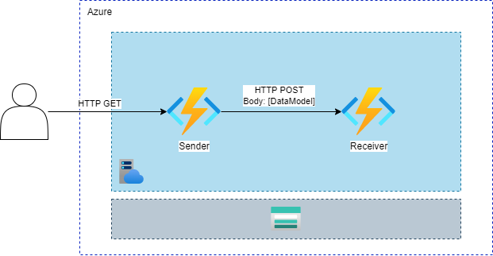

### GCP

The infrastructure required for a GCP deployment does not differ too much when comparing the Functions, however the storage resource required was only to house artifacts (zip files) that will be built and executed within each Cloud Function.

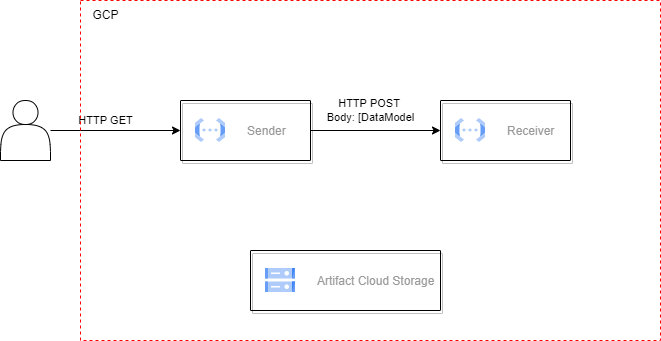

## Requirements

* [C# dotnet 6.0 SDK](https://dotnet.microsoft.com/en-us/download/dotnet/6.0)
* [C# Azure Functions Core Tools](https://learn.microsoft.com/en-us/azure/azure-functions/functions-run-local?tabs=v4%2Cwindows%2Ccsharp%2Cportal%2Cbash#install-the-azure-functions-core-tools) (used for creating Azure Function App templates, and deploying them to Azure)
* [Azure CLI](https://docs.microsoft.com/en-us/cli/azure/install-azure-cli) (used for interacting with Azure)
* [(Google) Cloud SDK](https://cloud.google.com/sdk/docs/install) (tools SDK for interacting with Google Cloud Platform)
* [Azurite](https://learn.microsoft.com/en-us/azure/storage/common/storage-use-azurite?tabs=github#install-azurite) (Azure Storage Account Emulator for local development)
* [Terraform](https://developer.hashicorp.com/terraform/tutorials/aws-get-started/install-cli) (Infrastructure as Code for deploying Azure / GCP resources)

## Development

Azure is the cloud platform which I have the most experience with, and will serve as a baseline to prove to myself that I can develop, deploy and run Serverless Architecture. Azure supports a subset of languages, compared to other cloud providers. To keep this spike simple, the selected programming language and automation tools will be chosen if they are supported by multiple cloud platform's serverless offerings. 

Unfortunately for me, I do not actively write code in languages supported by Azure... But it's gotta be done! I have some prior experience writing C# code in a Production environment, and it is a common language used for serverless resources across multiple cloud providers. I have chosen to use dotnet 6.0, for its Long-Term Support and cross-platform capability.

Requirements:
* C# dotnet 6.0
* az CLI

### Project Setup

TL;DR: This project contains various C# projects, starting with the top level Azure or GCP implementations of the sender and receiver. Each of these functions call common packages to ensure identical processing, such as how to create, structure or read a data structure modelling very simple item order requests. These underlying packages also have corresponding test packages. 

1. Navigate to /serverless_app.
1. Create solution file.
    ```
    dotnet new sln
    ```
1. Create common code and testing projects.
    ```
    dotnet new classlib -o data
    dotnet new classlib -o sender
    dotnet new classlib -o receiver

    dotnet new nunit -o data.test
    dotnet new nunit -o sender.test
    dotnet new nunit -o receiver.test
    
    # add to the solution
    dotnet sln add data/data.csproj sender/sender.csproj receiver/receiver.csproj data.test/data.test.csproj sender.test/sender.test.csproj receiver.test/receiver.test.csproj azure_host/azure_host.csproj azure_host.test\azure_host.test.csproj gcp_host/gcp_host.csproj
    ```
1. Set up cloud provider packages

    [Azure Functions](https://docs.microsoft.com/en-us/azure/azure-functions/functions-develop-vs-code?tabs=csharp)
    ```
    npm install -g azure-functions-core-tools@4 --unsafe-perm true

    # Azure Function App
    func init azure_host_receiver
    func init azure_host_sender
    # dotnet worker runtime
    ```
    [GCP Cloud Functions]()
    ```
    dotnet new gcf-http -o gcp_host_receiver
    dotnet new gcf-http -o gcp_host_sender
    ```
1. Add cloud provider projects to the solution
    ```
    dotnet sln add azure_host_receiver/azure_host_receiver.csproj
    dotnet sln add azure_host_sender/azure_host_sender.csproj
    dotnet sln add gcp_host_receiver/gcp_host_receiver.csproj
    dotnet sln add gcp_host_sender/gcp_host_sender.csproj
    ```
1. Reference the right projects to where they are needed
    ```
    dotnet add sender/sender.csproj reference data/data.csproj
    dotnet add receiver/receiver.csproj reference data/data.csproj

    # CLOUD PROVIDERS
    dotnet add azure_host_receiver/azure_host_receiver.csproj reference receiver/receiver.csproj data/data.csproj
    dotnet add azure_host_sender/azure_host_sender.csproj reference sender/sender.csproj data/data.csproj
    dotnet add gcp_host_receiver/gcp_host_receiver.csproj reference receiver/receiver.csproj data/data.csproj
    dotnet add gcp_host_sender/gcp_host_sender.csproj reference sender/sender.csproj data/data.csproj
    ```
1. Reference projects to test projects as required
    ```
    dotnet add data.test/data.test.csproj reference data/data.csproj
    dotnet add sender.test/sender.test.csproj reference sender/sender.csproj data/data.csproj
    dotnet add receiver.test/receiver.test.csproj reference receiver/receiver.csproj data/data.csproj
    ```
1. Update packages (per project, identify packages in `<PackageReference>` tags)
    ```
    cd /project
    dotnet add package PACKAGE_NAME
    ...
    ```

### Build and Unit Test

The common commands to run after making code changes are building and testing.

```
dotnet build serverless_app
dotnet test serverless_app/serverless_app.sln
```

### Environment Variables

This serverless application requires some additional configuration to work locally, in the cloud, and across cloud providers. Specifically, the sender requires the URI and (in the cloud) authentication code(s) are essential to operation. 

`local.settings.json` acts as an Azure Function App's configuration, which you would normally locate via Azure Portal > `function_app_name` > Configuration. All Environment Variables are found here, and are treated as a key value pair in JSON.

- `01_serverless_architecture/serverless_app/azure_host_sender/local.settings.json`
    ```json
    {
        "IsEncrypted": false,
        "Values": {
            "AzureWebJobsStorage": "",
            "FUNCTIONS_WORKER_RUNTIME": "dotnet",
            "RECEIVERADDR": "http://localhost:7071/api/receiver"
        }
    }
    ```

### Manual Testing Locally

#### Azure Functions

Azure Functions are quite nice to work with. Locally, they interface with Azurite (or the deprecated Microsoft Azure Storage Emulator) to successfully run multiple functions with the required underlying storage. You get a real-world experience right on your machine! 

```
# cmd prompt 1
azurite

# cmd prompt 2
cd azure_host_receiver
func start # defaults to port 7071

# cmd prompt 3
cd azure_host_sender
func start -p 7171 # port 7171
```

A GET request to `http://localhost:7171` is enough to trigger the sender function to call the receiver with successful actions.

#### GCP Cloud Functions

I encountered difficulty configuring environment variables for local testing, however this doesn't prevent testing that the receiver function operates as expected. 

```
# cmd prompt 1
dotnet run --project gcp_host_receiver/gcp_host_receiver.csproj --port 8080

# cmd prompt 2
dotnet run --project gcp_host_sender/gcp_host_sender.csproj --port 8081
```

A HTTP POST request to `http://localhost:8080` with the following body will produce logs in each command prompts which will confirm successful operation for us. 

```
[
    {
        "Id": 1,
        "Item": "Pen",
        "Quantity": 5,
        "Note": "Deliver ASAP"
    },
    {
        "Id": 2,
        "Item": "Paper",
        "Quantity": 2,
        "Note": "Deliver ASAP"
    }
]
```

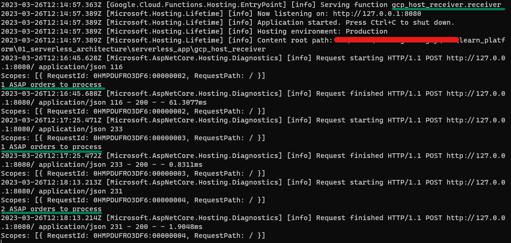

## Infrastructure

Terraform will be particularly applicable for deploying infrastructure quickly, between multiple cloud providers. Luckily, this bit (at least in Azure) is my day job, so this should be the least embarrassing part of thi first problem space!

### Terraform Remote State

Terraform best practice is to use a remote state. For such a small project scope, and being intended only for testing, a local Terraform state file would be easier.

My configuration should use Azure Blob Storage or a GCP Bucket as the location to save Terraform state. As long as the state Blob Storage is not maintained within the same Terraform configuration being deployed, no amount of Terraform plan / apply or other Terraform-originating changes will corrupt or invalidate the state file. The last thing I want is to accidentally destroy our Terraform state but not our resources...

### Sensitive Information

Functions will have domain names, and someone on a different continent may wish to test this project. To account for that, I need to ensure that there can be some uniqueness in naming conventions. 

GCP also requires the unique ID of the project which will contain the resources. This value is likely not something that should be exposed in a public repository, and is used in a Cloud Function's URI, which provides that unique naming.

As a result, one file must be populated and named correctly... Values in `terraform/vars/secrets.tfvars.example` should be populated correctly, then renamed to `secrets.tfvars`. This file can then be referenced in terraform commands to populate the outstanding values: 

```
terraform plan -var-file="vars/secrets.tfvars" -var-file="vars/az_only.tfvars"
```

### Proving the Design

The initial proof of concept is Azure to Azure communication between Receiver and Sender. I needed to successfully and reliably configure the `RECEIVERADDR` to reference the Receiver function. A simplified version of this line can be found below. It's complexity increases due to the intention to call Azure from GCP and vice versa under differenf configurations. 

```terraform
# terraform/az_deps.tf (line 29 - azurerm_linux_function_app.sender)
app_settings = {
    "RECEIVERADDR" = "https://${azurerm_linux_function_app.receiver[0].default_hostname}/api/receiver?code=${data.azurerm__function_app_host_keys.receiver[0].default_function_key}"
    "FUNCTIONS_WORKER_RUNTIME" = "dotnet"
}
```

### Azure Infrastructure

Function Apps and App Service resources are run on an App Service Plan (a managed server running a container instance). Many apps can be deployed to the same Plan, using the same pool of assigned resource (memory, CPU etc.). It is important to be mindful about the service reuqirements when choosing to use a Function App or App Service, and the tier in which it is run.

As the services making use of Serverless Architecture are designed to be cost effective and distributed, it is not uncommon to find that most infrastructure can be run ad-hoc, or only when required. Azure enables you to specify a "Consumption Plan" or "Dynamic" tier for an App Serivce Plan, which make the container and deployed applications go "cold" or almost effectively stop running, until called by a dependency. The nature of dynamically executing functions comes with a tradeoff, where requests take longer if the service is not already running. This is suitable for behind-the-scenes tasks, but maybe not for front-end interfaces that must be responsive all the time.

For the purpose of this problem space, cost is a major factor, so Consumption plan is the way to go, and the function can only run when called, so costs will always be low. Function Apps also require an underlying storage account (effectively a hard drive) to manage function state. This is used by some triggers to track work that has been done. For example, triggering on a new file being uploaded to a Blob Storage Account will produce a receipt, to prevent the function from attempting to read the file again.

#### Deploying Code to Azure Functions

I was faced with a new issue when attempting to deploy to Azure Functions for the first time in this project. I realised I had either been a Developer sending code into mystical pipelines, seeing the results later on, or the Platform Engineer, reworking or replicating other pipelines to deploy new infrastructure. My history with Azure DevOps extensions had me unprepared for deploying packaged code, made from scratch, to an accessible environment.

I had initially tried to use `dotnet publish`, PowerShell's `Compress-Archive` and finally `az functionapp deployment source config-zip` to produce the `.zip` I required for Run-From-Package, and deploy it. This lead to a day's worth of problem solving to identify why the Function App was not listing any functions while the underlying file system appeared to have them.

Eventually, I had success with an alternative to the above 3 commands, which I had already used previously to set up the initial C# projects - `func azure functionapp publish`!

### Google Cloud Infrastructure

Everything related to GCP is a learning experience for myself. I had to figure out how to set up a workspace to deploy my infrastructure to, and identify the correct configurations to be cost effective and fit-for-purpose.

Regardless of deploying Azure only or not, setting up Terraform requires the following commands due to the GCP provider being included. This would be a blocker for someone else attempting to deploying the Terraform in this project:

```
gcloud init
gcloud auth application-default login
```

I also encountered an unfamiliar practice in Terraform's `google_cloudfunctions_function` resource. In order to handle a zip deployment, the zip must be uploaded to a GCP Bucket before deployment. I could not identify an alternative that would work for this use case. 

#### Receiver Function Deployment with Terraform

I experienced issues deploying the first function to GCP with Terraform. I specified a GCP Bucket to contain zip files produced with `dotnet publish`. I had a hunch that my mileage with the publish command wouldn't get me far, as I already failed to use it for Microsoft Azure. The error, `Error waiting for Creating CloudFunctions Function: Error code 3, message: Function failed on loading user code. This is likely due to a bug in the user code.`, suggested the code (or published result) was not correct.

I attempted variations of the alternative, `gcloud functions deploy` by setting the `--entry-point` to various settings believing that was the issue. Running it in the source code directory, `/severless_app/gcp_host_receiver`, showed various errors about the receiver and data `.csproj` files not existing. I was able to replicate the Terraform error via the resulting directory from the `dotnet publish` command.

#### Local CLI Deployment Breakthrough

I am unsure what changed, but I was able to used `gcloud functions deploy` with the following configuration to achieve a successful deployment from the source directory.

```
gcloud functions deploy <FUNCTION_NAME> \
    --region europe-west2 \
    --source=. \
    --entry-point=gcp_host_receiver.receiver \
    --runtime dotnet6 \
    --trigger-http
```

There was one catch, however. An attempt to test the function directly in GCP's web interface threw an unhandled exception, which I assumed was related back to the errors I received during deployment from the source directory. More investigation and testing was required to understand what was going wrong during deployment preparations. Viewing and downloading the source zip from the Cloud Function showed that the data and receiver `.dll`'s were present in `/bin`. 

I was also unable to identify many good examples of C# deployments which featured multiple packaged dependencies, developed locally. This prevents me from understanding how Cloud Functions prepares Functions with dependencies, which would allow me to adjust my development method accordingly.

```
System.IO.FileNotFoundException: Could not load file or assembly 'receiver, Version=1.0.0.0, Culture=neutral, PublicKeyToken=null'. The system cannot find the file specified.

File name: 'receiver, Version=1.0.0.0, Culture=neutral, PublicKeyToken=null'
   at gcp_host_receiver.receiver.HandleAsync(HttpContext context)
   at System.Runtime.CompilerServices.AsyncMethodBuilderCore.Start[TStateMachine](TStateMachine& stateMachine)
   at gcp_host_receiver.receiver.HandleAsync(HttpContext context)
   at Google.Cloud.Functions.Hosting.HostingInternals.Execute(HttpContext context)
   at Microsoft.AspNetCore.Server.Kestrel.Core.Internal.Http.HttpProtocol.ProcessRequests[TContext](IHttpApplication`1 application)
```

#### Successfully Deploying Code to GCP Functions

I stumbled upon this useful [document](https://github.com/GoogleCloudPlatform/functions-framework-dotnet/blob/main/docs/deployment.md#deploying-a-function-with-a-local-project-dependency), which explained I would need to deploy from the C# project's parent directory, `/severless_app`, due to `<ProjectReference>` attributes in the project files. I was able to successfully deploy and test via the interface.

```
gcloud functions deploy fnc-receiver --region europe-west2 --source=. --entry-point=gcp_host_receiver.receiver --runtime dotnet6 --trigger-http --set-build-env-vars "GOOGLE_BUILDABLE=gcp_host_receiver/gcp_host_receiver.csproj"
```

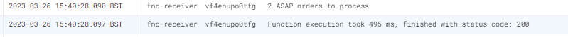

A subsequent attempt to use `dotnet publish` across the whole C# project, zipped and deployed with Terraform produced the same errors as previously. 

I then decided to try zipping the C# project, this time skipping the call to `dotnet publish`. Combined with the earlier success of setting `GOOGLE_BUILDABLE`, the following Terraform apply was successful!

## Findings

### Azure to Azure

The initial proof of concept, demonstrating what I already understood about the cloud, involved deploying both the Sender and Receiver to Azure, and having them successfully interact.

I was able to send a request to Sender via Postman, with a HTTP 200 response.

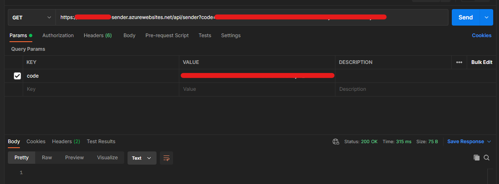

Next, I had to prove that the interaction happened. As I had deployed the bare minimum resources required, there was no Application Insights to easily surface the logging I was after. Instead, I downloaded relevant log files from this location:

Azure Portal > Receiver or Sender Function App > Advanced Tools > "Go" > Debug Console banner (CMD) > `LogFiles/Application/Functions/Function/{receiver/sender}/*.log`

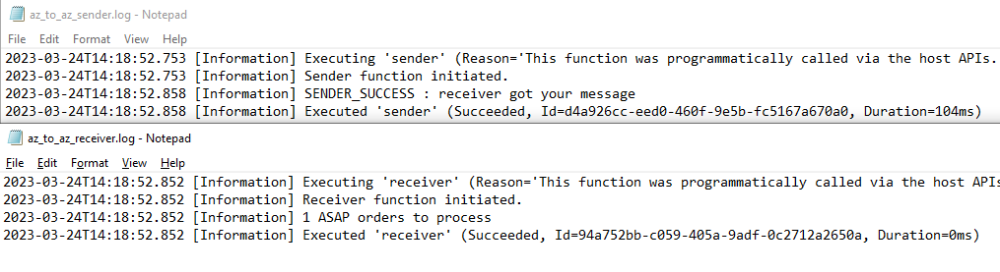

The screenshot shows the renamed log files from Sender and Receiver, demonstrating with timestamps, that Sender triggered first. It then sent a request to Receiver, waited for a successful response, then logged the receiver's success, and completed.

#### Azure - Retrieving Receiver's Function Key

I had noticed that (on 24/03/2023) Function App keys can take a while to appear on Azure Portal. The first successful, complete deployment spent ~5 minutes waiting for a successful response from Azure Resource Manager to populate the Terraform `azurerm_function_app_host_keys` resource. Subsequent creations then failed to retrieve a key, and the key did not appear in Azure after an hour, leaving Terraform state file in an unrecoverable way, leading to manual cleanup.

### GCP to GCP

After having several breakthroughs in Cloud Function deployments, I had amended the Terraform configuration accordingly. Due to the sender function's dependency on the receiver being created first, I was able to test the receiver was operation via a full C# project zip before the Terraform apply had completed. Following the apply's successful completion, I triggered the sender function with a GET request directly in the Testing tab in GCP's web interface. The resulting screenshots, similar to that of Azure to Azure, proved that the sender function triggered the receiver, and both had completed successfully.

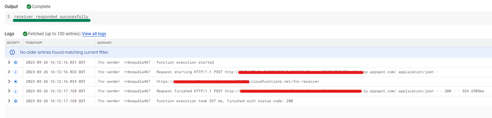

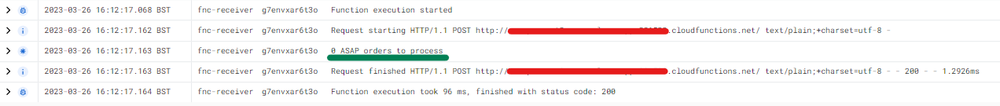

### GCP Send to Azure Receiver

The next phase involves deploying the functions cross-cloud, and confirming that they can successfully interact. I had concerns about this due to the issues retrieving the Azure Function key during Azure to Azure deployment. Fortunately, the host key retrieval (or generation, so I am lead to believe) was more reliable on that day.

As I already knew how to quickly handle Azure Function authentication (though not best practice), by using function or host keys in the query string, Azure hosted the Receiver function first.

Once set up was complete, I was able to prove that GCP had a successfully configured `RECEIVERADDR` setting, pointing to the Azure Receiver Function.

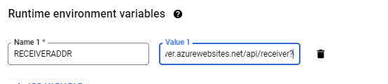

The next step was to trigger the Sender function to test this configuration's success. This ran without issue on the first attempt, as illustrated by the logs.

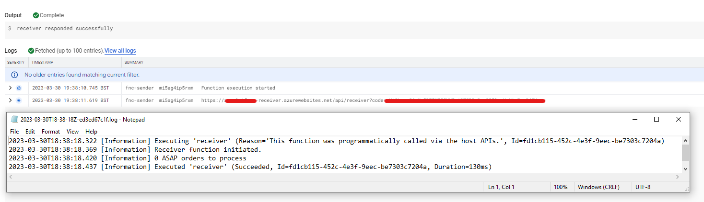

### Azure Send to GCP Receiver

I was quite prepared for the final, alternative configuration to throw several errors relating to authentication when the Sender function in Azure attempted to send a request to the Receiver function in GCP. Evidently, I had enough default set up inferred from various documentation that meant I did not need to provide a function key or impersonate another user or application (e.g. using a similar approach to Azure's App Registrations).

The deployment was successful, however due to having recently tidied up from GCP Send to Azure Receive, there was a conflict on the name of the Azure Storage Account. This was rectified by rerunning `terraform apply`.

The Azure Function had successfully populated the `RECEIVERADDR` setting, pointing to the GCP Receiver Function.

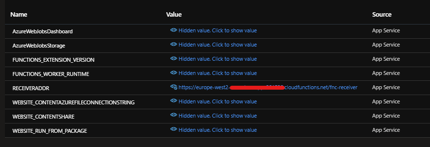

Finally, executing the Sender Function was able to successfully invoke GCP's Receiver. 

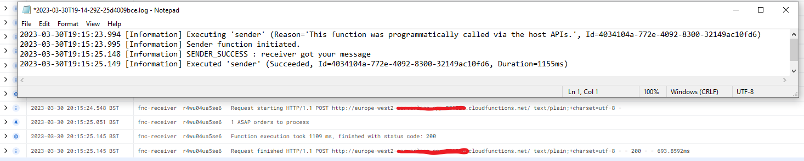

## Streamlining Deployment

Due to the intention of this project to reconfigure the infrastructure to demonstrate different cloud deployments, it is incredibly helpful to have a method of deploying where there is less manual intervention. 

In `/automation_scripts`, there is a single PowerShell (Core) script, named `local_azure_build_deploy.ps1` which was created to reflect what a CI/CD pipeline would achieve.

This script enables myself and anyone else to quickly configure a deployment to Azure or GCP. 

```
# deploy Azure only
.\local_build_deploy.ps1 -deploy_azure

# deploy GCP send, Azure receive
.\local_build_deploy.ps1 -deploy_azure -deploy_gcp -az_receiver

# destroy GCP only deployment
.\local_build_deploy.ps1 -deploy_gcp -destroy

# deploy Azure only, skip build
.\local_build_deploy.ps1 -deploy_azure -skip_build
```

### Workflow

Whether writing a script to speed up development locally, or using a CI/CD platform, there are some consistent steps to be taken:

1. Build
1. Test
1. Package
1. Deploy Infrastructure
1. Deploy Code

Any failures in one step should prevent the script from actioning something later. For example, a failing build will not permit testing to run. Without successful tests, there would be no benefit from deploying code.